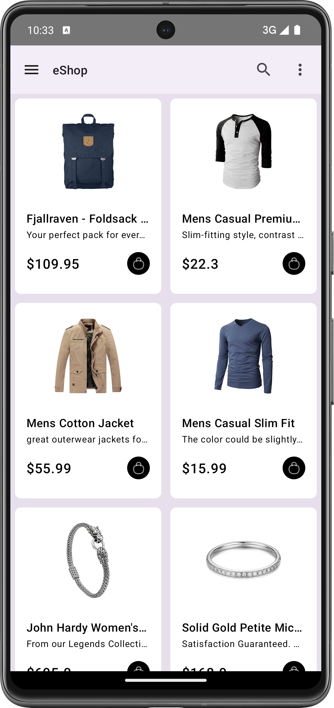

# eShop App with MVVM + Retrofit + Use Cases + Mapper + Dagger Hilt + Coroutines + Flow + Generics + Sealed class & broadcast receiver using Jetpack Compose

Welcome to the eShop App! This Android application is designed to provide users with a seamless shopping experience, allowing them to browse through a variety of products and make purchases directly from their mobile devices. Built with modern Android development tools and architectural patterns, including Retrofit, MVVM, Hilt, Coroutines, Flow, and broadcast receiver using Jetpack Compose, this app combines robust functionality with a sleek and intuitive user interface.

## Features

- **Product Listings**: Browse through a wide range of products, organized into categories for easy navigation.
- **Product Details**: View detailed information about each product, including descriptions, prices, and availability.
- **Broadcast receiver **: Dynamic UI check Internet Connection.

## Architecture

The eShop App follows a modern and scalable architecture based on the MVVM (Model-View-ViewModel) pattern. This architecture separates concerns between the data layer, presentation layer, and UI components, ensuring maintainability, testability, and flexibility throughout the development process.

- **Model**: Represents the data and business logic of the application, including entities, repositories, and data sources.
- **View**: Displays the user interface elements and interacts with the ViewModel to retrieve and present data.
- **ViewModel**: Acts as an intermediary between the View and the Model, handling user interactions, data fetching, and business logic.

## Technologies Used

- **Retrofit**: For handling network requests and API communication.
- **MVVM**: Architectural pattern for organizing code and separating concerns.
- **Hilt**: Dependency injection framework for managing dependencies and improving code modularity.
- **Coroutines**: Asynchronous programming library for handling background tasks and concurrency.
- **Flow**: Reactive stream library for handling asynchronous data flows.
- **Jetpack Compose**: Modern UI toolkit for building native Android user interfaces.
- **Broadcast Receiver**: Component for listening to and responding to system-wide broadcast messages.

| MainPage | Details Page | 
|------------|-------------|
|  |  |
## Getting Started

To run the eShop App locally and explore its features, follow these steps:

1. Clone the repository to your local machine.
2. Open the project in Android Studio.
3. Build and run the app on an Android emulator or physical device.
4. Explore the various screens and functionalities of the app.

## Contributing

Contributions to the eShop App are welcome! If you encounter any bugs, have suggestions for improvements, or would like to contribute new features, feel free to submit a pull request or open an issue on the GitHub repository.

## License

The eShop App is licensed under the [MIT License](LICENSE), allowing for both personal and commercial use with attribution. See the LICENSE file for more details.

---
By: [Dinesh2510]
